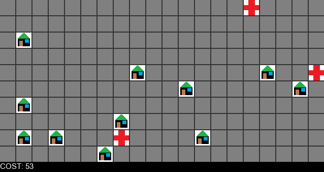

# Optimization Algorithms Comparison

## Description

A project inspired by a lecture on optimization from CS50's Introduction to Artificial Intelligence with Python course. It implements 3 optimization algorithms: hill climbing, hill climbing random restart, which uses the hill climbing algorithm the number of times given as an argument, and the simulated annealing algorithm. The algorithms given solve the problem of placing hospitals in such a way that the sum of the shortest house-to-hospital distances is the smallest. The project also implemented functions to visualize the individual steps of the algorithms using the Pillow package.

## Example of Hill Climbing Algorithm Steps

